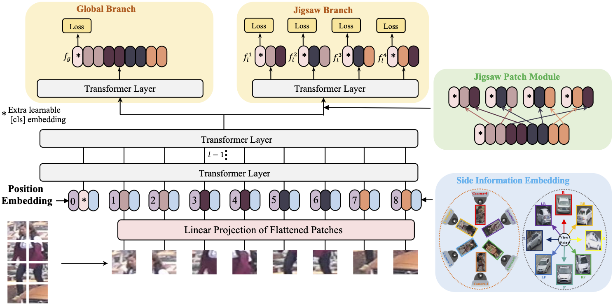
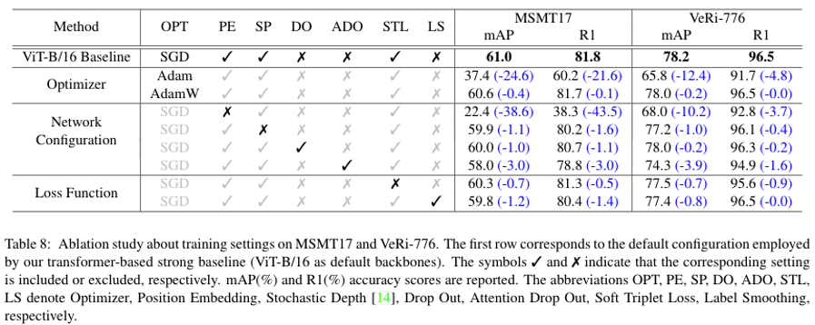

# [ICCV2021] TransReID: Transformer-based Object Re-Identification [[pdf]](https://openaccess.thecvf.com/content/ICCV2021/papers/He_TransReID_Transformer-Based_Object_Re-Identification_ICCV_2021_paper.pdf)

The *official* repository for  [TransReID: Transformer-based Object Re-Identification](https://arxiv.org/abs/2102.04378) achieves state-of-the-art performances on object re-ID, including person re-ID and vehicle re-ID.

## News
- 2021.12 We improve TransReID via self-supervised pre-training. Please refer to [TransReID-SSL](https://github.com/michuanhaohao/TransReID-SSL)
- 2021.3  We release the code of TransReID.

## Pipeline



## Abaltion Study of Transformer-based Strong Baseline




## Requirements

### Installation

```bash
pip install -r requirements.txt
(we use /torch 1.6.0 /torchvision 0.7.0 /timm 0.3.2 /cuda 10.1 / 16G or 32G V100 for training and evaluation.
Note that we use torch.cuda.amp to accelerate speed of training which requires pytorch >=1.6)
```

### Prepare Datasets

```bash
mkdir data
```

Download the person datasets [Market-1501](https://drive.google.com/file/d/0B8-rUzbwVRk0c054eEozWG9COHM/view), [MSMT17](https://arxiv.org/abs/1711.08565), [DukeMTMC-reID](https://arxiv.org/abs/1609.01775),[Occluded-Duke](https://github.com/lightas/Occluded-DukeMTMC-Dataset), and the vehicle datasets [VehicleID](https://www.pkuml.org/resources/pku-vehicleid.html), [VeRi-776](https://github.com/JDAI-CV/VeRidataset), 
Then unzip them and rename them under the directory like

```
data
├── market1501
│   └── images ..
├── MSMT17
│   └── images ..
├── dukemtmcreid
│   └── images ..
├── Occluded_Duke
│   └── images ..
├── VehicleID_V1.0
│   └── images ..
└── VeRi
    └── images ..
```

### Prepare DeiT or ViT Pre-trained Models

You need to download the ImageNet pretrained transformer model : [ViT-Base](https://github.com/rwightman/pytorch-image-models/releases/download/v0.1-vitjx/jx_vit_base_p16_224-80ecf9dd.pth), [ViT-Small](https://github.com/rwightman/pytorch-image-models/releases/download/v0.1-weights/vit_small_p16_224-15ec54c9.pth), [DeiT-Small](https://dl.fbaipublicfiles.com/deit/deit_small_distilled_patch16_224-649709d9.pth), [DeiT-Base](https://dl.fbaipublicfiles.com/deit/deit_base_distilled_patch16_224-df68dfff.pth)

## Training

We utilize 1  GPU for training.

```bash
python train.py --config_file configs/transformer_base.yml MODEL.DEVICE_ID "('your device id')" MODEL.STRIDE_SIZE ${1} MODEL.SIE_CAMERA ${2} MODEL.SIE_VIEW ${3} MODEL.JPM ${4} MODEL.TRANSFORMER_TYPE ${5} OUTPUT_DIR ${OUTPUT_DIR} DATASETS.NAMES "('your dataset name')"
```

#### Arguments

- `${1}`: stride size for pure transformer, e.g. [16, 16], [14, 14], [12, 12]
- `${2}`: whether using SIE with camera, True or False.
- `${3}`: whether using SIE with view, True or False.
- `${4}`: whether using JPM, True or False.
- `${5}`: choose transformer type from `'vit_base_patch16_224_TransReID'`,(The structure of the deit is the same as that of the vit, and only need to change the imagenet pretrained model)  `'vit_small_patch16_224_TransReID'`,`'deit_small_patch16_224_TransReID'`,
- `${OUTPUT_DIR}`: folder for saving logs and checkpoints, e.g. `../logs/market1501`

**or you can directly train with following  yml and commands:**

```bash
# DukeMTMC transformer-based baseline
python train.py --config_file configs/DukeMTMC/vit_base.yml MODEL.DEVICE_ID "('0')"
# DukeMTMC baseline + JPM
python train.py --config_file configs/DukeMTMC/vit_jpm.yml MODEL.DEVICE_ID "('0')"
# DukeMTMC baseline + SIE
python train.py --config_file configs/DukeMTMC/vit_sie.yml MODEL.DEVICE_ID "('0')"
# DukeMTMC TransReID (baseline + SIE + JPM)
python train.py --config_file configs/DukeMTMC/vit_transreid.yml MODEL.DEVICE_ID "('0')"
# DukeMTMC TransReID with stride size [12, 12]
python train.py --config_file configs/DukeMTMC/vit_transreid_stride.yml MODEL.DEVICE_ID "('0')"

# MSMT17
python train.py --config_file configs/MSMT17/vit_transreid_stride.yml MODEL.DEVICE_ID "('0')"
# OCC_Duke
python train.py --config_file configs/OCC_Duke/vit_transreid_stride.yml MODEL.DEVICE_ID "('0')"
# Market
python train.py --config_file configs/Market/vit_transreid_stride.yml MODEL.DEVICE_ID "('0')"
# VeRi
python train.py --config_file configs/VeRi/vit_transreid_stride.yml MODEL.DEVICE_ID "('0')"

# VehicleID (The dataset is large and we utilize 4 v100 GPUs for training )
CUDA_VISIBLE_DEVICES=0,1,2,3 python -m torch.distributed.launch --nproc_per_node=4 --master_port 66666 train.py --config_file configs/VehicleID/vit_transreid_stride.yml MODEL.DIST_TRAIN True
#  or using following commands:
Bash dist_train.sh 
```

Tips:  For person datasets  with size 256x128, TransReID with stride occupies 12GB GPU memory and TransReID occupies 7GB GPU memory. 

## Evaluation

```bash
python test.py --config_file 'choose which config to test' MODEL.DEVICE_ID "('your device id')" TEST.WEIGHT "('your path of trained checkpoints')"
```

**Some examples:**

```bash
# DukeMTMC
python test.py --config_file configs/DukeMTMC/vit_transreid_stride.yml MODEL.DEVICE_ID "('0')"  TEST.WEIGHT '../logs/duke_vit_transreid_stride/transformer_120.pth'
# MSMT17
python test.py --config_file configs/MSMT17/vit_transreid_stride.yml MODEL.DEVICE_ID "('0')" TEST.WEIGHT '../logs/msmt17_vit_transreid_stride/transformer_120.pth'
# OCC_Duke
python test.py --config_file configs/OCC_Duke/vit_transreid_stride.yml MODEL.DEVICE_ID "('0')" TEST.WEIGHT '../logs/occ_duke_vit_transreid_stride/transformer_120.pth'
# Market
python test.py --config_file configs/Market/vit_transreid_stride.yml MODEL.DEVICE_ID "('0')"  TEST.WEIGHT '../logs/market_vit_transreid_stride/transformer_120.pth'
# VeRi
python test.py --config_file configs/VeRi/vit_transreid_stride.yml MODEL.DEVICE_ID "('0')" TEST.WEIGHT '../logs/veri_vit_transreid_stride/transformer_120.pth'

# VehicleID (We test 10 times and get the final average score to avoid randomness)
python test.py --config_file configs/VehicleID/vit_transreid_stride.yml MODEL.DEVICE_ID "('0')" TEST.WEIGHT '../logs/vehicleID_vit_transreid_stride/transformer_120.pth'
```

## Trained Models and logs (Size 256)


<table>
<thead>
<tr><th style='text-align:center;' >Datasets</th><th style='text-align:center;' >MSMT17</th><th style='text-align:center;' >Market</th><th style='text-align:center;' >Duke</th><th style='text-align:center;' >OCC_Duke</th><th style='text-align:center;' >VeRi</th><th style='text-align:center;' >VehicleID</th></tr></thead>
<tbody><tr><td style='text-align:center;' ><strong>Model</strong></td><td style='text-align:center;' >mAP | R1</td><td style='text-align:center;' >mAP | R1</td><td style='text-align:center;' >mAP | R1</td><td style='text-align:center;' >mAP | R1</td><td style='text-align:center;' >mAP | R1</td><td style='text-align:center;' >R1 | R5</td></tr><tr><td style='text-align:center;'rowspan="2" ><strong>Baseline(ViT)</strong></td>
  <td style='text-align:center;' >61.8 | 81.8</td><td style='text-align:center;' >87.1 | 94.6</td><td style='text-align:center;' >79.6 | 89.0</td><td style='text-align:center;' >53.8 | 61.1</td><td style='text-align:center;' >79.0 | 96.6</td><td style='text-align:center;' >83.5 | 96.7</td></tr><tr>  <td style='text-align:center;' ><a href='https://drive.google.com/file/d/1iF5JNPw9xi-rLY3Ri9EY-PFAkK6Vg_Pf/view?usp=sharing'>model</a> | <a href='https://drive.google.com/file/d/1oCnLpwv-V_RU7_BNXFsIgXKxAm2QAD7n/view?usp=sharing'>log</a></td><td style='text-align:center;' ><a href='https://drive.google.com/file/d/1crYsKRrW4eUq6abT4KK8_atMLFsbq56W/view?usp=sharing'>model</a> | <a href='https://drive.google.com/file/d/1YSo6FgJ42SOv3TTQvzE_4V1r3Ma608lZ/view?usp=sharing'>log</a></td><td style='text-align:center;' ><a href='https://drive.google.com/file/d/17GQqFuTleAZWLD92AtEd1c_dnTyZHl4k/view?usp=sharing'>model</a> | <a href='https://drive.google.com/file/d/1a8Ci3qN4Y47LRWqgbeF4HJON1hBmeLCn/view?usp=sharing'>log</a></td><td style='text-align:center;' ><a href='https://drive.google.com/file/d/1uHX5j7yepalN1EINdF9lzrT3iDWj-pr9/view?usp=sharing'>model</a> | <a href='https://drive.google.com/file/d/1urUfrvML_7qKvqXyz6Yl4msJS6nTNbe5/view?usp=sharing'>log</a></td><td style='text-align:center;' ><a href='https://drive.google.com/file/d/1Qu13CS5MK1ANsXoYgkX5Kji383SbQbn9/view?usp=sharing'>model</a> | <a href='https://drive.google.com/file/d/17Io4ECJixITduJ-bey7yix1Unwv9PBKd/view?usp=sharing'>log</a></td><td style='text-align:center;' ><a href='https://drive.google.com/file/d/1loUlRlM9DCiIAkq5mpL4LrJiUC3G3fMp/view?usp=sharing'>model</a> | <a href='https://drive.google.com/file/d/12gOI9fivkRj5utCPciKS6Z1SNM8V2SGT/view?usp=sharing'>test</a></td></tr><tr><td style='text-align:center;'rowspan="2" ><strong>TransReID<sup>*</sup>(ViT)</strong></td>
  <td style='text-align:center;' >67.8 | 85.3</td><td style='text-align:center;' >89.0 | 95.1</td><td style='text-align:center;' >82.2 | 90.7</td><td style='text-align:center;' >59.5 | 67.4</td><td style='text-align:center;' >82.1 | 97.4</td><td style='text-align:center;' >85.2 | 97.4</td></tr><tr>
  <td style='text-align:center;' ><a href='https://drive.google.com/file/d/1x6Na97ycxS0t2Dn_0iRKWe1U5ccIqASK/view?usp=sharing'>model</a> | <a href='https://drive.google.com/file/d/14TPDaU2T0WLTsg0iEHJFnqwzSTrpzC0B/view?usp=sharing'>log</a></td><td style='text-align:center;' ><a href='https://drive.google.com/file/d/11p4RjmpCGGAS-876VEt7OoFrUeHTUlyO/view?usp=sharing'>model</a> | <a href='https://drive.google.com/file/d/1SWNtnhEVoDu3Uixf5XBCQlvXYapVrk7w/view?usp=sharing'>log</a></td><td style='text-align:center;' ><a href='https://drive.google.com/file/d/1BipxoqyThefQviJzuJIKtFJvNblIlPGN/view?usp=sharing'>model</a> | <a href='https://drive.google.com/file/d/11dE_kbNWbvmo-3qUShN7qsrTsqd89Eoc/view?usp=sharing'>log</a></td><td style='text-align:center;' ><a href='https://drive.google.com/file/d/1VJg4rTA43TCHkR9hTIBu8S2Sy1KiTnSJ/view?usp=sharing'>model</a> | <a href='https://drive.google.com/file/d/1I1xTSBl1v-QBSyxxAB7xIszW_fu9oT6g/view?usp=sharing'>log</a></td><td style='text-align:center;' ><a href='https://drive.google.com/file/d/1SquTlBhl_pahsa5752KoGDBPY-AZpoSg/view?usp=sharing'>model</a> | <a href='https://drive.google.com/file/d/1H3MpDrA61HMmo8x8teANpCxY7BoGo09r/view?usp=sharing'>log</a></td><td style='text-align:center;' ><a href='https://drive.google.com/file/d/13ArCZutLuFrAoZpBuuk1y3EW91cYubmU/view?usp=sharing'>model</a> | <a href='https://drive.google.com/file/d/1ibJjqyLFvMv8vO9WanVi-5pYsJD4LY7K/view?usp=sharing'>test</a></td></tr><tr><td style='text-align:center;'rowspan="2" ><strong>TransReID<sup>*</sup>(DeiT)</strong></td>
  <td style='text-align:center;' >66.3 | 84.0</td><td style='text-align:center;' >88.5 | 95.1</td><td style='text-align:center;' >81.9 | 90.7</td><td style='text-align:center;' >57.7 | 65.2</td><td style='text-align:center;' >82.4 | 97.1</td><td style='text-align:center;' >86.0 | 97.6</td></tr><tr>
  <td style='text-align:center;' ><a href='https://drive.google.com/file/d/1WSUD0gKjGIG_gzTc2izH_y-EuDzweN95/view?usp=sharing'>model</a> | <a href='https://drive.google.com/file/d/1-YWh-Z1JVN8xzjG7PNyN2TpWN4Z1eUvP/view?usp=sharing'>log</a></td><td style='text-align:center;' ><a href='https://drive.google.com/file/d/1cbUK2KozdPSoewzvF0ucFQnZ0yfZiu_H/view?usp=sharing'>model</a> | <a href='https://drive.google.com/file/d/1C9glb0kc5thfU3U9Yrr6z7h5oYgMwHfy/view?usp=sharing'>log</a></td><td style='text-align:center;' ><a href='https://drive.google.com/file/d/1ltaX9zGFO31Wwwu47K9c4WTTBZVLdzLw/view?usp=sharing'>model</a> | <a href='https://drive.google.com/file/d/13H9usPg7pG5b6Eglx0EiKDiU6n3chBnT/view?usp=sharing'>log</a></td><td style='text-align:center;' ><a href='https://drive.google.com/file/d/1YJkBiMb5oVBnO6GXYW3Y_hFkR-Pl5ikC/view?usp=sharing'>model</a> | <a href='https://drive.google.com/file/d/1xnPlCw3w5obBpEAaI8Sb7Z5Bh9dPcZtL/view?usp=sharing'>log</a></td><td style='text-align:center;' ><a href='https://drive.google.com/file/d/1n26yrqTwu8bvaS-L_8mmiPlIrw_2_Ryo/view?usp=sharing'>model</a> | <a href='https://drive.google.com/file/d/11hTccnvJCi8Be_1fArX3mWqgdwOarxAf/view?usp=sharing'>log</a></td><td style='text-align:center;' ><a href='https://drive.google.com/file/d/1YC8dvKiCg5qCKpRc4kHemaUdFdBePkAk/view?usp=sharing'>model</a> | <a href='https://drive.google.com/file/d/1cELmjTLj5Lo9QwJuDGbqftwjeYAQD17k/view?usp=sharing'>test</a></td></tr></tbody>
</table>

Note: We reorganize code and the performances are slightly different from the paper's.

## Acknowledgement

Codebase from [reid-strong-baseline](https://github.com/michuanhaohao/reid-strong-baseline) , [pytorch-image-models](https://github.com/rwightman/pytorch-image-models)

We import veri776 viewpoint label from repo: https://github.com/Zhongdao/VehicleReIDKeyPointData

## Citation

If you find this code useful for your research, please cite our paper

```
@InProceedings{He_2021_ICCV,
    author    = {He, Shuting and Luo, Hao and Wang, Pichao and Wang, Fan and Li, Hao and Jiang, Wei},
    title     = {TransReID: Transformer-Based Object Re-Identification},
    booktitle = {Proceedings of the IEEE/CVF International Conference on Computer Vision (ICCV)},
    month     = {October},
    year      = {2021},
    pages     = {15013-15022}
}
```

## Contact

If you have any question, please feel free to contact us. E-mail: [shuting_he@zju.edu.cn](mailto:shuting_he@zju.edu.cn) , [haoluocsc@zju.edu.cn](mailto:haoluocsc@zju.edu.cn)

